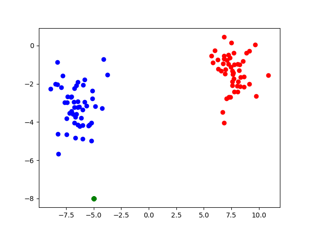

# k-近傍法
教師あり学習「分類」の実装です
pandas, numpyを用いて実装しています


試しに以下のコードを付け足してみてください

```Python
label = k_nn(features, labels, data, clusters=2, k=5)

for index, i in enumerate(labels):
    if i == 0:
        plt.scatter(features.loc[index, 0], features.loc[index, 1] , color="r")
    else:
        plt.scatter(features.loc[index, 0], features.loc[index, 1] , color="b")

    plt.scatter(data[:, 0], data[:, 1], color="g")

plt.show()
```


